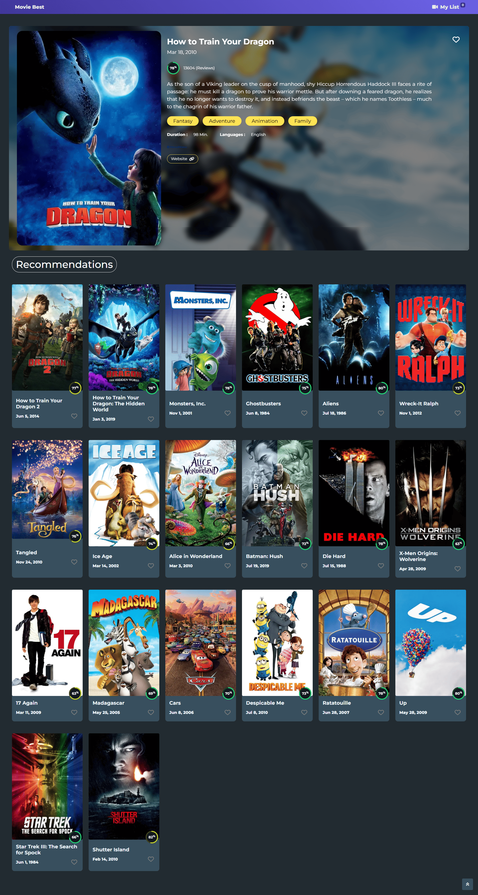
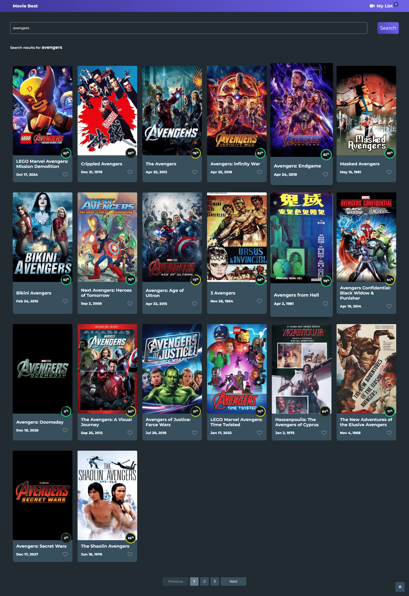

# 🎬 Movie App – Angular 19

This project is a movie browsing application built using **Angular 19**. It was developed as part of the **ITI ICC Training Program**, showcasing routing, services, API integration, and responsive UI using Bootstrap and FontAwesome.

---

## 🚀 Live Demo

Link – [Movie App](https://iti-angular-movie-app.vercel.app/)

---

## 🔄 Project Origin

This repository is a clean version extracted from the original team repository that contains the full commit history of the collaboration.

👉 [Original Team Repository](https://github.com/malikhussein/ITI-angular-movie-app)

## 📸 Screenshots

  
  
  

## 🧠 Features

- Search and browse movies
- View detailed info for each movie
- Responsive design with Bootstrap 5
- Smooth navigation using Angular Router
- Modern UI with FontAwesome icons

---

## 🛠️ Tech Stack

- **Angular** 19.1.0
- **Bootstrap** 5.3.3
- **FontAwesome** 6.7.2
- **RxJS** 7.8.0
- **Zone.js** 0.15.0

> Check `package.json` for full dependencies.

---

## 👥 Our Team

| Name          | GitHub Profile                                         |
| ------------- | ------------------------------------------------------ |
| Mohamed Ahmed | [@MohamedAhIsmail](https://github.com/MohamedAhIsmail) |
| Malik Hussein | [@malikhussein](https://github.com/malikhussein)       |
| Ahmed Amr     | [@ahmedamr3000](https://github.com/ahmedamr3000)       |
| Mohamed Eid   | [@Mohamedeid602](https://github.com/Mohamedeid602)     |
| Omar Abdeen   | [@OmarAbdeen](https://github.com/Test0-VC)             |


## 🧩 How to Run Locally

```bash
# Clone the repository
git clone https://github.com/MohamedAhIsmail/movie-app-angular.git

# Navigate into the project directory
cd movie-app-angular

# Install dependencies
npm install

# Run the app
ng serve
