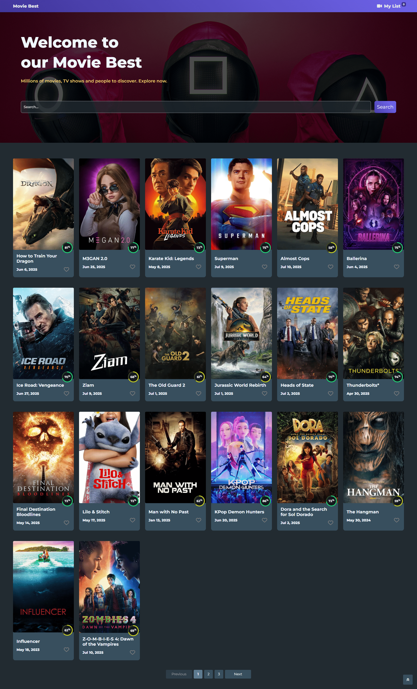

# 🎬 Movie App – Angular 19

This project is a movie browsing application built using **Angular 19**. It was developed as part of the **ITI ICC Training Program**, showcasing routing, services, API integration, and responsive UI using Bootstrap and FontAwesome.

---

## 🚀 Live Demo

Link – [ITI ICC Training Program](https://iti-angular-movie-app.vercel.app/)()

---

## 📸 Screenshots

> Add your screenshots inside a folder named `/screenshots` and embed them below:
  

| Name          | GitHub Profile                               |
| ------------- | -------------------------------------------- |
| Mohamed Ahmed | [@mohamedahmed](https://github.com/USERNAME) |
| Member 2 Name | [@username](https://github.com/username)     |
| Member 3 Name | [@username](https://github.com/username)     |
| Member 4 Name | [@username](https://github.com/username)     |
